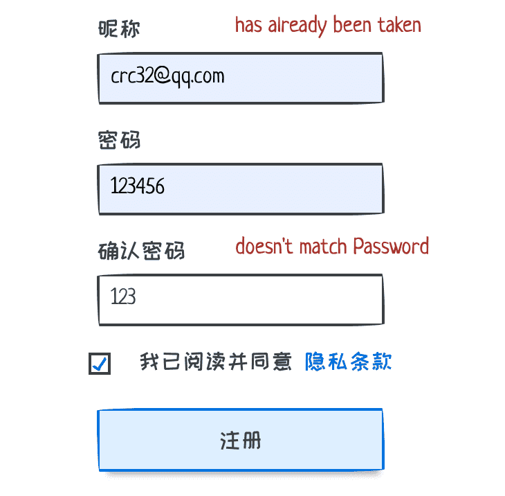
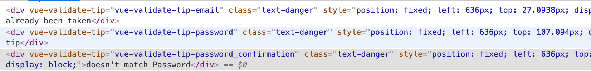

# vue-otto-validate
[](https://travis-ci.org/bung87/vue-otto-validate)  [](https://lgtm.com/projects/g/bung87/vue-otto-validate/alerts/)
[](https://lgtm.com/projects/g/bung87/vue-otto-validate/context:javascript) [](https://www.npmjs.com/package/vue-otto-validate)    

## Install

```sh
$ yarn add vue-otto-validate
```
## Usage  
import it , use as plugin , show errors when http response errors.
```js
import Validator,{showErrors} from "vue-otto-validate"
Vue.use(Validator,{className:"text-danger"})
axios.post(...).catch(r => {showErrors( r.response.data.errors)});
// errors object : {fieldName:["message1","message2"...],...}
// if you using rails you already known
```
add directive `v-validate="{leftOffset:100,topOffset:8}"` among with `v-model` to element.  

only need one attribute format as below  
`v-validate:position.className1.className2=optionsObj`  

__notice__: currently only supports `position = "leftTop"`  

preview:



results html:



## dist

```sh
$ yarn dist
```

## start and watch

```sh
$ yarn start
```
